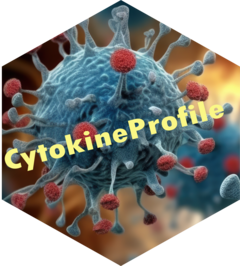

```{r, include = FALSE}
library(bslib)
knitr::opts_chunk$set(
  collapse = TRUE,
  comment = "#>",
  out.width = "100%"
)
```

## R package and R Shiny Application for Comprehensive Cytokine Analysis

<a href="https://cytokineprofile.org/" class="hero-logo-link">
  
</a>


CytokineProfile is designed for advanced cytokine data analysis. It provides a comprehensive suite of functions for exploratory, univariate, and multivariate analysis as well as machine learning methods tailored to your cytokine datasets.

[Get Started](applications.html)

## Why Cytokine Profiling?

Cytokine profiling serves as an invaluable tool in biomedical research and diagnostics, shedding light on immune responses and disease mechanisms through the analysis of cytokine interactions. Existing tools lack features specifically tailored to the complexities of cytokine data.

**CytokineProfile** fills this gap by providing a comprehensive pipeline—from data import and quality control to advanced machine-learning classification and publication-ready visualizations.

## Key Features at a Glance

<div class="row">
  
<div class="col-md-4">
**• Data Preprocessing & QC**  
Load CSV/Excel and detect outliers.
</div>

<div class="col-md-4">
**• Exploratory & Multivariate Analysis**  
Boxplots, PCA, and PLS-DA (with confidence ellipses & backgrounds).
</div>

<div class="col-md-4">
**• Machine Learning**  
XGBoost and Random Forest.
</div>

<div class="col-md-5">
**• Advanced Visualizations**  
Dual-flashlight plots, effect-size–enriched error bars, volcano plots.
</div>

<div class="col-md-5">
**• R Shiny Application**  
User-friendly Shiny Application for non-coders.
</div>

</div>
